# MVP — Pipeline de Dados Olist E-commerce

> MVP de conclusão da Sprint 4 da Pós-graduação em Ciência de Dados e Analytics — PUC-Rio.
> Pipeline de dados ponta a ponta na nuvem (Databricks/Lakehouse), arquitetura medalhão (Bronze → Silver → Gold), sobre o dataset público **Olist Brazilian E-commerce**.

**Autor:** Lucas Alves

**Matrícula: 4052025002019

**Plataforma:** Databricks Free Edition (Unity Catalog, Delta Lake, PySpark/Spark SQL)

**Repositório:** todo o código deste projeto (notebooks e documentação) está neste repositório GitHub, sincronizado com o workspace do Databricks via Databricks Repos.

## Sumário

1. [Contexto de Negócios e Perguntas (Etapa 2 e 4.1)](#1-contexto-de-negócios-e-perguntas-etapa-2-e-41)
2. [Carga dos Dados (Etapa 4.2)](#2-carga-dos-dados-etapa-42)
3. [Modelagem e Catálogo de Dados (Etapa 4.3)](#3-modelagem-e-catálogo-de-dados-etapa-43)
4. [Pipeline de Dados (Etapa 4.4)](#4-pipeline-de-dados-etapa-44)
5. [Qualidade de Dados (Etapa 4.5)](#5-qualidade-de-dados-etapa-45)
6. [Análise de Dados (Etapa 4.5)](#6-análise-de-dados-etapa-45)
7. [Autoavaliação](#7-autoavaliação)
8. [Estrutura do repositório](#8-estrutura-do-repositório)

---

## 1. Contexto de Negócios e Perguntas (Etapa 2 e 4.1)

### Problema

Quero entender quais fatores impactam a satisfação do cliente e a performance comercial e logística no e-commerce da Olist, para identificar oportunidades de melhoria operacional e comercial.

### Perguntas de negócio

1. **Entrega x satisfação**: o atraso na entrega (data real vs. estimada) impacta a nota de avaliação (`review_score`)?
2. **Receita por categoria**: quais categorias de produto têm maior ticket médio e maior participação na receita total?
3. **Logística e expansão**:
   - 3a. Qual estado seria mais indicado para receber um novo Centro de Distribuição (CD)/hub, considerando volume de pedidos, custo médio de frete e tempo de entrega para aquela região?
   - 3b. Quais categorias de produto teriam maior demanda/volume nesse estado, justificando estoque prioritário nesse hub?
4. **Pagamento**: qual a forma de pagamento mais usada e como o número de parcelas se relaciona ao valor do pedido?
5. **Sazonalidade**: existe sazonalidade mensal nas vendas ao longo do período coberto pelo dataset?
6. **Performance de vendedor**: vendedores com tempo médio de entrega menor recebem avaliações melhores?
7. **Recência e recompra**: qual a taxa de clientes que fazem mais de uma compra (usando `customer_unique_id`, não `customer_id`) e qual o tempo médio entre a primeira e a segunda compra, entre os que recompram?

### Fonte de dados e licença

**Dataset**: [Olist Brazilian E-commerce Public Dataset](https://www.kaggle.com/datasets/olistbr/brazilian-ecommerce) (Kaggle)
**Licença**: CC BY-NC-SA 4.0 (uso não comercial, com atribuição, compartilhamento pela mesma licença) — compatível com o uso acadêmico deste MVP.

### Contexto e estrutura dos dados brutos

O dataset é composto por 9 arquivos CSV, representando pedidos reais feitos na marketplace Olist entre 2016 e 2018, com pedidos, clientes, produtos, vendedores, pagamentos, avaliações e geolocalização — cada arquivo corresponde a uma entidade do negócio, relacionadas entre si principalmente por `order_id`, `customer_id` e `product_id`.

| Arquivo | Linhas | Colunas | Conteúdo |
|---|---|---|---|
| `olist_orders_dataset.csv` | 99.441 | 8 | Pedidos: status, datas de compra/aprovação/entrega/estimativa |
| `olist_customers_dataset.csv` | 99.441 | 5 | Clientes: `customer_id` (por pedido) e `customer_unique_id` (por pessoa), cidade/estado |
| `olist_order_items_dataset.csv` | 112.650 | 7 | Itens de cada pedido: produto, vendedor, preço, frete |
| `olist_order_payments_dataset.csv` | 103.886 | 5 | Pagamentos: forma, parcelas, valor |
| `olist_order_reviews_dataset.csv` | 99.224 | 7 | Avaliações: nota, comentário, datas de criação/resposta |
| `olist_products_dataset.csv` | 32.951 | 9 | Produtos: categoria, peso, dimensões |
| `olist_sellers_dataset.csv` | 3.095 | 4 | Vendedores: cidade, estado |
| `olist_geolocation_dataset.csv` | 1.000.163 | 5 | Coordenadas geográficas por prefixo de CEP |
| `product_category_name_translation.csv` | 71 | 2 | Tradução do nome da categoria (PT → EN) |

**Nota de qualidade de dados já identificada:** o campo `customer_id` é praticamente único por pedido — não identifica a mesma pessoa em compras diferentes. A identificação real do cliente ao longo do tempo usa `customer_unique_id` (essencial para a pergunta 7; ver [Qualidade de Dados](#5-qualidade-de-dados-etapa-45)).

📄 Documento completo: [`docs/01-contexto-negocios-e-perguntas.md`](docs/01-contexto-negocios-e-perguntas.md)

---

## 2. Carga dos Dados (Etapa 4.2)

### Como foi feita a coleta

1. Os 9 arquivos CSV foram baixados manualmente do Kaggle, após verificação da licença CC BY-NC-SA 4.0.
2. Os arquivos foram enviados para um **Volume do Unity Catalog** no Databricks (`/Volumes/workspace/default/olist_raw`), via upload manual pela interface do Databricks (Catalog → Create Volume → Upload). Etapa não automatizada por ser uma ação pontual de configuração do ambiente, feita uma única vez.
3. Os dados **não foram versionados no GitHub** — apenas o código que os processa. O caminho `data/raw/` está no `.gitignore`, conforme permitido pelo enunciado ("Não é necessário a disponibilização dos dados").

### Como os dados sobem para a plataforma de nuvem

A leitura dos CSVs para dentro do Databricks (camada Bronze) é feita via script, documentado e versionado no GitHub:

- **Script**: [`notebooks/01_bronze_ingestao.py`](notebooks/01_bronze_ingestao.py)
- O notebook lê cada um dos 9 CSVs do Volume, com tratamento de encoding UTF-8 e de campos multilinha entre aspas (necessário porque `review_comment_message` contém quebras de linha dentro do texto — ver [Qualidade de Dados](#5-qualidade-de-dados-etapa-45)), e grava cada um como tabela Delta no schema `bronze` do Unity Catalog.

**Evidência de execução:**

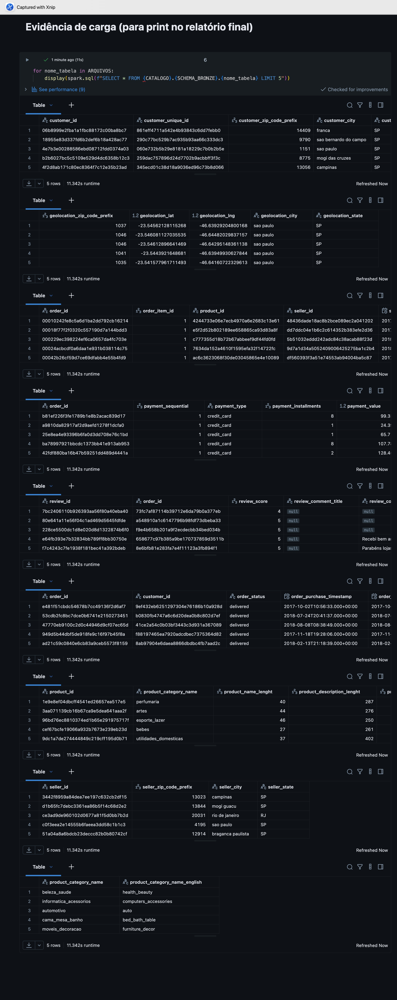

📄 Documento completo: [`docs/05-carga-dos-dados.md`](docs/05-carga-dos-dados.md)

---

## 3. Modelagem e Catálogo de Dados (Etapa 4.3)

### Visão geral do modelo

O modelo escolhido é uma **constelação de fatos** (fact constellation): três tabelas fato, com grãos diferentes, compartilhando cinco dimensões comuns — decisão tomada porque as perguntas de negócio operam em grãos distintos (item de pedido, pagamento, avaliação) que não caberiam bem em uma única tabela fato / esquema estrela simples.

```
                         dim_data
                             │
        dim_cliente ── dim_pedido ── dim_produto
                        │      │
           fato_pedido_itens   fato_pagamentos
                        │
                 fato_avaliacoes

        dim_vendedor ──┘ (referenciada por fato_pedido_itens)
```

- **fato_pedido_itens** — grão: 1 linha por item de pedido.
- **fato_pagamentos** — grão: 1 linha por forma de pagamento usada em um pedido.
- **fato_avaliacoes** — grão: 1 linha por avaliação (review) de pedido.
- **Dimensões**: dim_cliente, dim_produto, dim_vendedor, dim_data, dim_pedido.

Camadas: **Bronze** (CSV cru) → **Silver** (tipado, limpo, deduplicado) → **Gold** (modelo dimensional acima). Todas as tabelas Gold são gravadas como tabelas **Delta** no Unity Catalog do Databricks, cumprindo o requisito de Catálogo de Dados (Unity Catalog registra schema, tipos e linhagem nativamente).

### Catálogo de dados (resumo)

| Tabela | Grão / Chave | Principais colunas |
|---|---|---|
| `dim_cliente` | 1 linha por `customer_unique_id` | sk_cliente, customer_unique_id, customer_city, customer_state, customer_zip_code_prefix |
| `dim_produto` | 1 linha por `product_id` | sk_produto, product_id, product_category_name_english, product_weight_g, dimensões |
| `dim_vendedor` | 1 linha por `seller_id` | sk_vendedor, seller_id, seller_city, seller_state |
| `dim_data` | 1 linha por data | data, ano, mes, dia, nome_mes, trimestre, dia_da_semana, fim_de_semana |
| `dim_pedido` | 1 linha por `order_id` | sk_pedido, order_id, sk_cliente, order_status, data_compra, dias_atraso |
| `fato_pedido_itens` | 1 linha por item de pedido | sk_pedido, sk_produto, sk_vendedor, order_item_id, price, freight_value |
| `fato_pagamentos` | 1 linha por forma de pagamento no pedido | sk_pedido, payment_sequential, payment_type, payment_installments, payment_value |
| `fato_avaliacoes` | 1 linha por avaliação | sk_pedido, review_score, dias_resposta |

O catálogo completo — com tipo, domínio de valores, descrição e linhagem de **cada coluna** de cada tabela, além da tabela de rastreabilidade "pergunta de negócio → tabelas necessárias" e das dimensões de qualidade aplicadas — está em:

📄 Documento completo: [`docs/02-modelagem-catalogo-dados.md`](docs/02-modelagem-catalogo-dados.md)

**Evidência do Catálogo de Dados no Unity Catalog:**

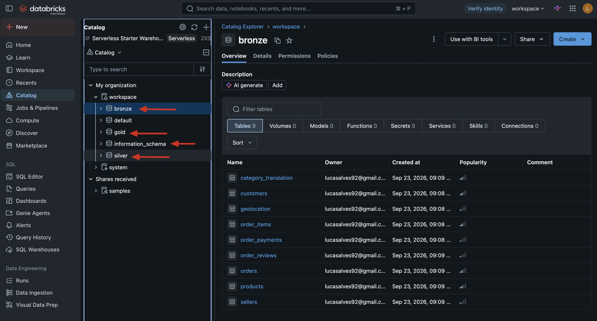

---

## 4. Pipeline de Dados (Etapa 4.4)

O pipeline ETL foi **ramificado em notebooks separados, um por camada da arquitetura medalhão**, em vez de um único notebook monolítico — isso isola cada responsabilidade (ingestão, limpeza, modelagem, análise) e facilita reexecução independente e depuração de erros.

| Notebook | Camada | O que faz |
|---|---|---|
| [`notebooks/01_bronze_ingestao.py`](notebooks/01_bronze_ingestao.py) | Bronze | Lê os 9 CSVs brutos do Volume e grava cada um como tabela Delta em `bronze.*`, sem transformação de conteúdo. |
| [`notebooks/02_silver_limpeza.py`](notebooks/02_silver_limpeza.py) | Silver | Tipagem, padronização de texto, deduplicação e checagens de qualidade; grava em `silver.*`. |
| [`notebooks/03_gold_modelo_dimensional.py`](notebooks/03_gold_modelo_dimensional.py) | Gold | Constrói o modelo dimensional (5 dimensões + 3 fatos) com surrogate keys; grava em `gold.*`. |
| [`notebooks/04_analise_perguntas_negocio.py`](notebooks/04_analise_perguntas_negocio.py) | Análise | Consulta as tabelas Gold via SQL para responder às 7 perguntas de negócio. |

Execução: os notebooks rodam manualmente, em sequência (01 → 02 → 03 → 04), no Databricks, via Databricks Repos sincronizado com este repositório. Cada tabela é persistida como Delta table no Unity Catalog (`saveAsTable`, `mode("overwrite")`, com `overwriteSchema=true` quando o schema muda entre execuções).

**Evidência de execução e persistência das tabelas em cada camada:**

| Bronze | Silver | Gold |
|---|---|---|
|  | 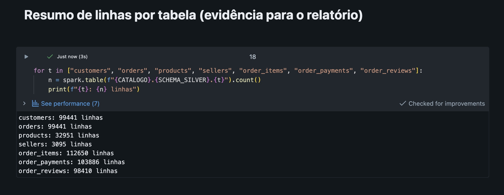 | 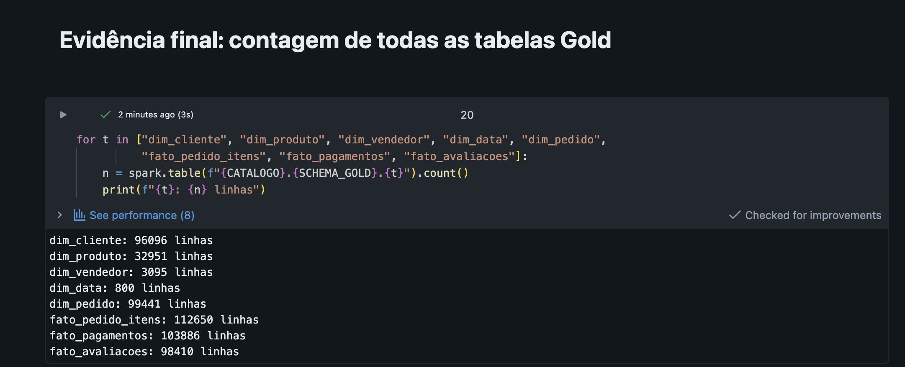 |

📄 Documento completo: [`docs/07-pipeline-de-dados.md`](docs/07-pipeline-de-dados.md)

---

## 5. Qualidade de Dados (Etapa 4.5)

Verificações aplicadas na camada Silver (`notebooks/02_silver_limpeza.py`), organizadas pelas cinco dimensões de qualidade de dados trabalhadas na disciplina:

| Dimensão de qualidade | Tabela | Achado | Ação tomada |
|---|---|---|---|
| Completude | customers | 0% nulos em `customer_unique_id` | Nenhuma |
| Acurácia | orders | 0 status fora do domínio esperado | Nenhuma |
| Completude | products | 1,89% sem categoria original | Marcado como `categoria_nao_informada` (evita perda de receita nas agregações) |
| Outliers | order_items | 1.966 itens (1,75%) com `price` acima de média + 3 desvios-padrão (limite R$ 671,56) | Mantidos, sinalizados para revisão na Análise |
| Unicidade | todas as dimensões | duplicatas identificadas por chave de negócio | `dropDuplicates` aplicado |
| Consistência | orders, order_items, order_reviews | tipos e parsing de CSV corrigidos | Cast de tipos + opções `multiLine`/`quote`/`escape` no leitor CSV |

Destaque: o problema mais sutil encontrado foi de **consistência/parsing** — o campo `review_comment_message` contém vírgulas e quebras de linha dentro de texto entre aspas, o que inicialmente desalinhava colunas inteiras na leitura do CSV (erro `CAST_INVALID_INPUT`, com um trecho de comentário de cliente indo parar na coluna de data). Corrigido com as opções `multiLine`, `quote` e `escape` do leitor CSV do Spark.

📄 Documento completo (com resultado, evidência numérica e conclusão de cada verificação): [`docs/03-qualidade-de-dados.md`](docs/03-qualidade-de-dados.md)

---

## 6. Análise de Dados (Etapa 4.5)

Resultados obtidos a partir das tabelas Gold ([`notebooks/04_analise_perguntas_negocio.py`](notebooks/04_analise_perguntas_negocio.py)), executado no Databricks.

### Resumo executivo

| # | Pergunta | Achado principal |
|---|---|---|
| 1 | Atraso x satisfação | Nota média cai de 4,29 (no prazo) para 1,85 (atraso de 4+ dias); atraso leve já derruba a nota para um patamar neutro (3,29) |
| 2 | Receita por categoria | `health_beauty`, `watches_gifts` e `bed_bath_table` lideram a receita total |
| 3a | Estado para novo CD | **Minas Gerais (MG)**: 3º em volume de pedidos, entre os piores em atraso médio, posição geográfica central |
| 3b | Categorias no estado escolhido | Perfil de demanda em MG reproduz de perto o ranking nacional da pergunta 2 |
| 4 | Pagamento x parcelas | Cartão de crédito domina (73,3% dos pagamentos), é a única forma parcelada e tem o maior ticket médio (R$ 163,32) |
| 5 | Sazonalidade mensal | Crescimento consistente em 2017–2018, com pico isolado em novembro/2017 (Black Friday) |
| 6 | Vendedor x avaliação | Entrega adiantada favorece nota alta nos melhores vendedores, mas a relação é mais fraca e ruidosa entre os piores — outros fatores (produto, atendimento) também pesam |
| 7 | Recência/recompra | Apenas 3,12% dos clientes (`customer_unique_id`) recompram; intervalo médio de 80,3 dias entre 1ª e 2ª compra |

Cada achado acima é discutido em detalhe — com tabelas completas, interpretação de negócio, recomendações e ressalvas metodológicas (ex.: efeito de censura à direita na taxa de recompra, artefato de cobertura do dataset nos meses de borda) — no documento completo.

**Evidência de resultado de cada pergunta:**

| P1 | P2 | P3 (a/b) | P4 |
|---|---|---|---|
| 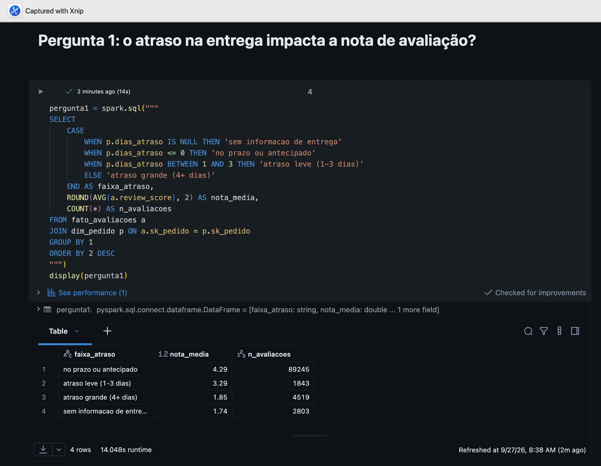 | 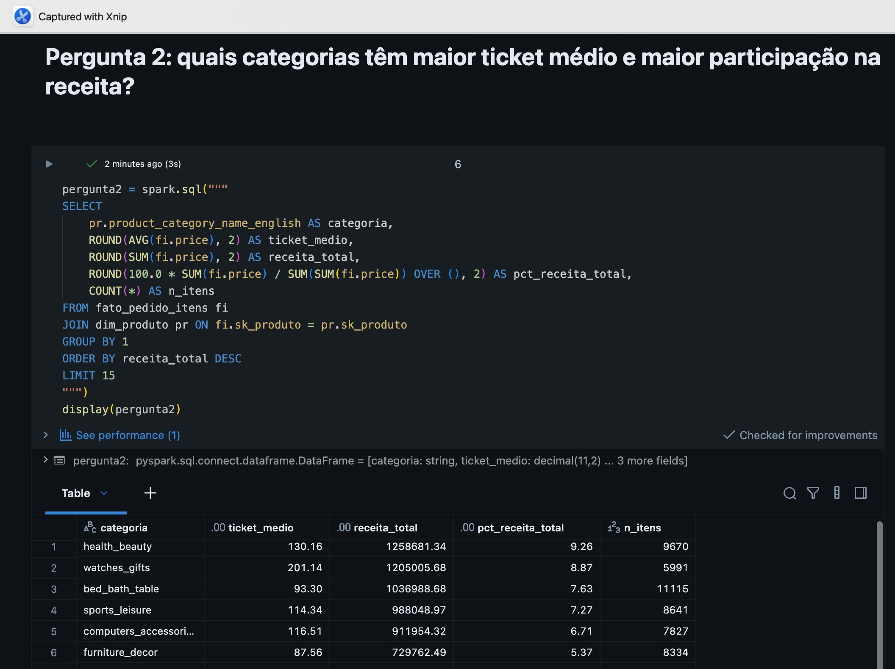 | 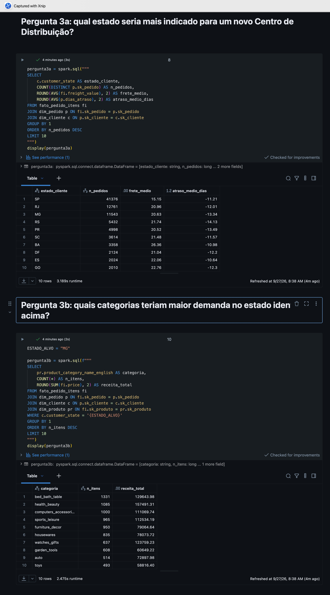 | 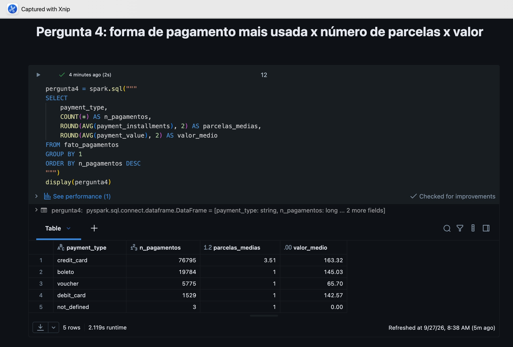 |

| P5 | P6 | P7 |
|---|---|---|
| 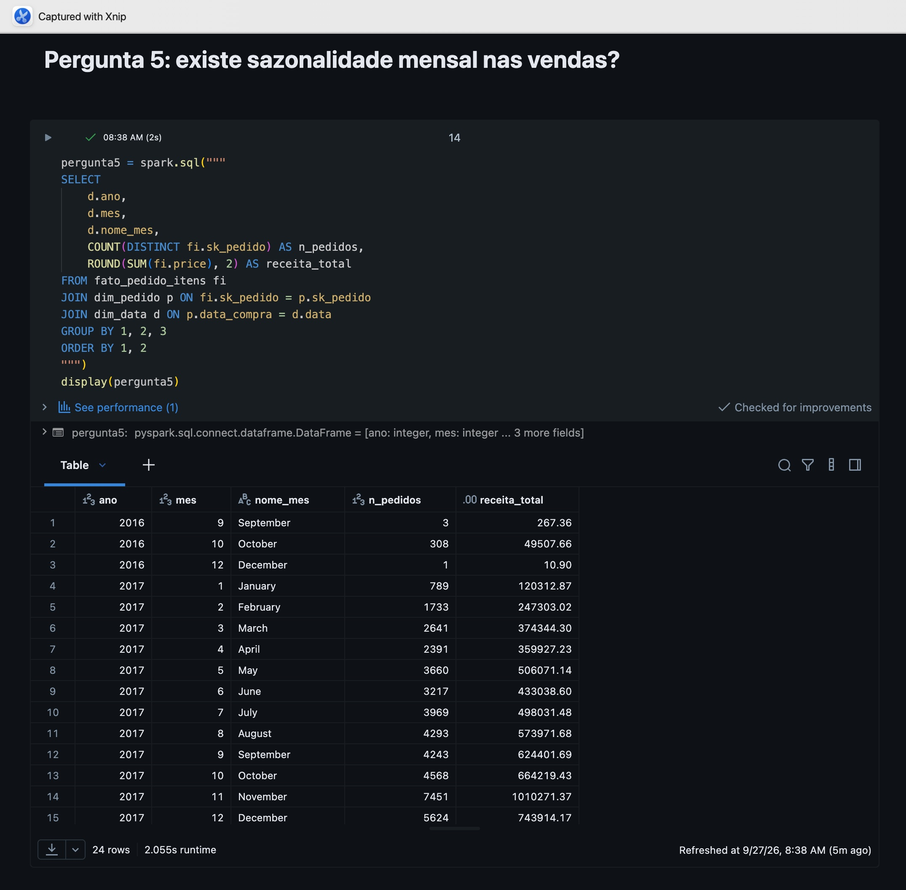 | 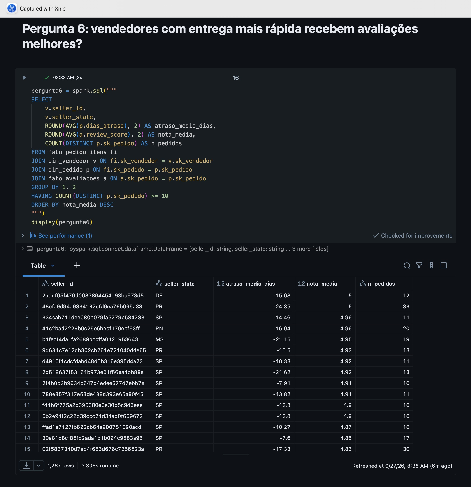 | 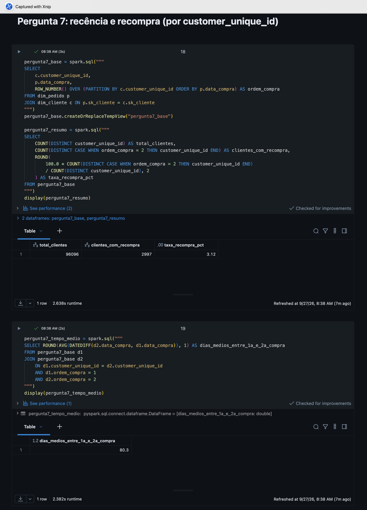 |

📄 Documento completo: [`docs/04-analise-resultados.md`](docs/04-analise-resultados.md)

---

## 7. Autoavaliação

### Objetivos atingidos

O objetivo inicial era construir um pipeline de dados completo (Bronze → Silver → Gold) sobre o dataset Olist e responder 7 perguntas de negócio ligadas a satisfação do cliente, receita, logística, pagamento, sazonalidade e recompra. Esse objetivo foi atingido: as 7 perguntas foram respondidas com dados reais extraídos do modelo dimensional construído, com discussão e recomendações de negócio para cada uma.

O modelo de dados evoluiu de uma ideia inicial de esquema estrela simples para uma **constelação de fatos** (3 fatos, 5 dimensões), decisão tomada ao perceber que as perguntas de negócio operavam em grãos diferentes que não caberiam bem em uma única tabela fato.

### Dificuldades encontradas

- **Qualidade de dados do CSV bruto**: o campo `review_comment_message` contém texto livre com vírgulas e quebras de linha dentro de aspas, o que inicialmente corrompia o parsing do CSV e deslocava colunas inteiras — um problema sutil, só percebido ao investigar um erro de tipo aparentemente não relacionado.
- **Ambiente Databricks Free Edition**: por bloquear automação de navegador (medida de segurança da própria plataforma), grande parte da configuração inicial (criação de Volume, upload de arquivos, sincronização via Repos) precisou ser feita manualmente, passo a passo.
- **Erros de schema em reexecuções**: o Delta Lake exige autorização explícita (`overwriteSchema=true`) para mudar o schema de uma tabela já existente, o que gerou alguns erros até esse comportamento ficar claro.

### Trabalhos futuros

- Trazer dados de margem/custo por categoria de produto, para complementar a análise de receita (pergunta 2) com uma visão de rentabilidade, não só de faturamento.
- Aplicar testes estatísticos formais (não só comparação de médias) para validar a significância dos achados, principalmente da pergunta 1 (atraso x satisfação).
- Investigar mais a fundo os vendedores com entrega adiantada mas nota baixa (achado da pergunta 6), cruzando com o texto das avaliações para entender a causa raiz da insatisfação.

📄 Documento completo: [`docs/06-autoavaliacao.md`](docs/06-autoavaliacao.md)

---

## 8. Estrutura do repositório

```
.
├── README.md                              # este documento
├── docs/
│   ├── 01-contexto-negocios-e-perguntas.md
│   ├── 02-modelagem-catalogo-dados.md
│   ├── 03-qualidade-de-dados.md
│   ├── 04-analise-resultados.md
│   ├── 05-carga-dos-dados.md
│   ├── 06-autoavaliacao.md
│   └── 07-pipeline-de-dados.md
├── notebooks/
│   ├── 01_bronze_ingestao.py
│   ├── 02_silver_limpeza.py
│   ├── 03_gold_modelo_dimensional.py
│   └── 04_analise_perguntas_negocio.py
├── evidencias/                            # screenshots de execução, catálogo e resultados
└── data/raw/                              # dados brutos (não versionados — ver .gitignore)
```
